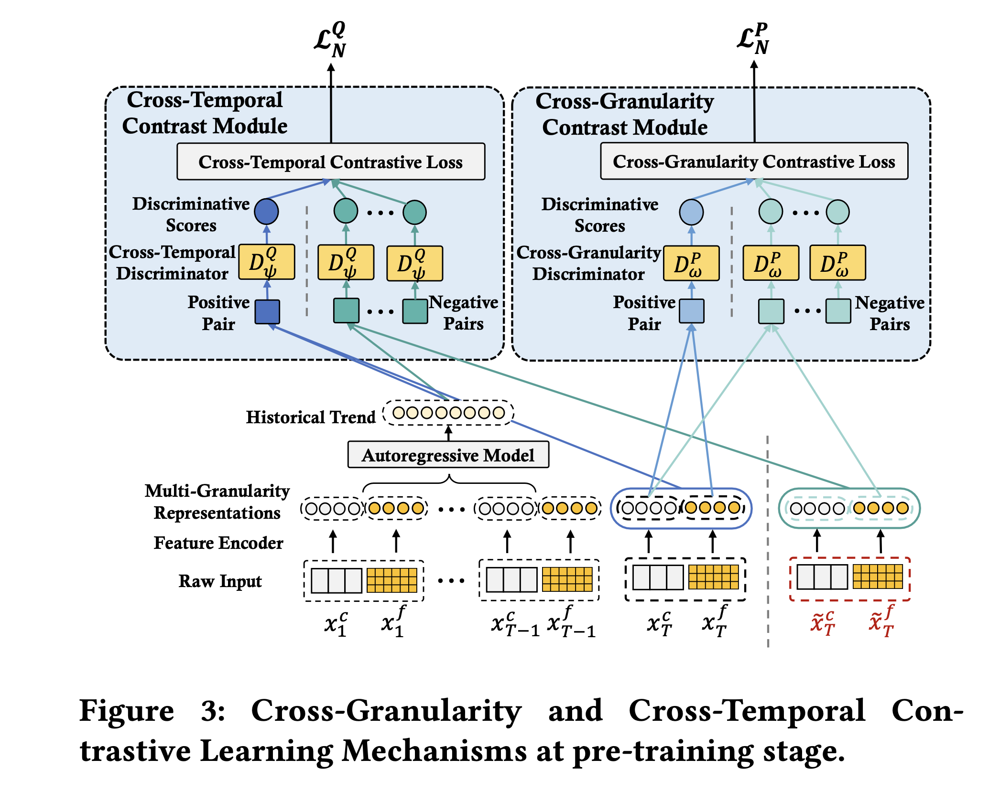
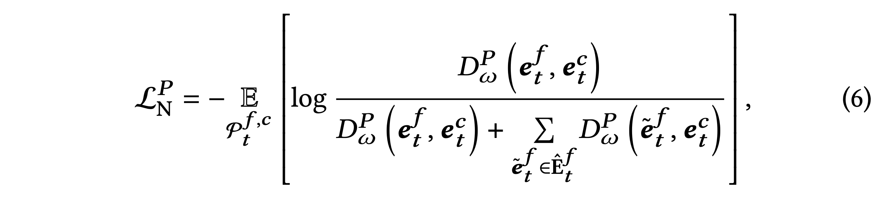
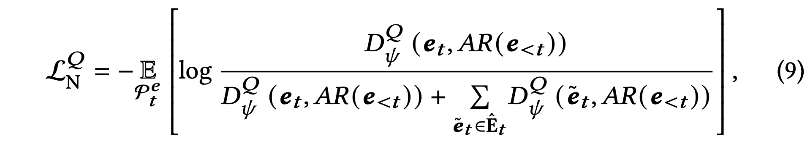
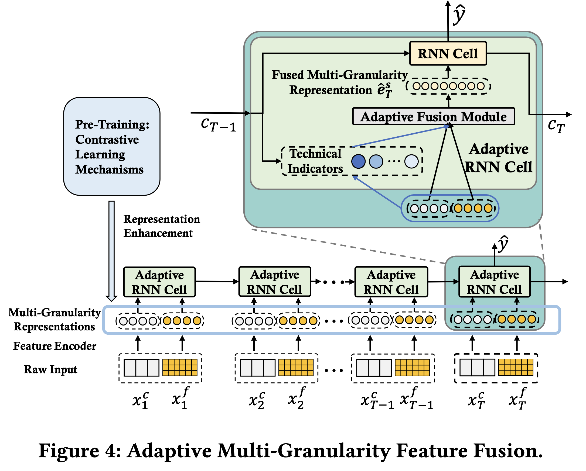
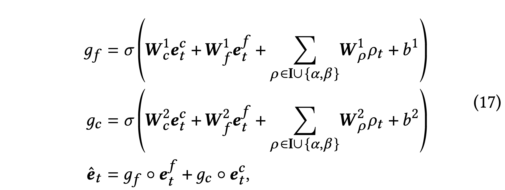
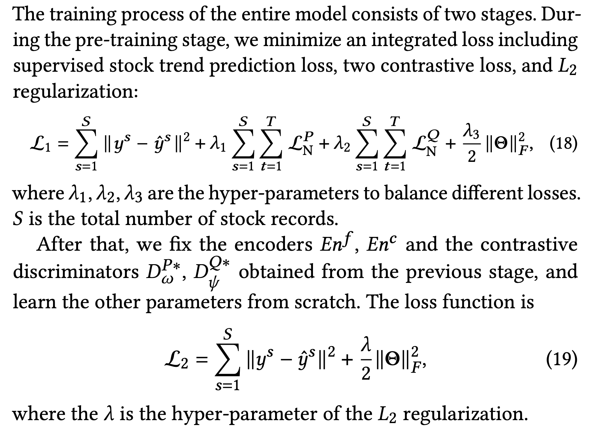

# Karry-Paper-Daily

```python
Karry-Paper-Daily/
├── PaperLibrary # The library of all reading papers.
    ├── Multi-Granularity Data # The paper about Multi-Granularity Data Prediction.
        ├── CMLF # A Contrastive Learning Approach with Adaptive Fusion.
            ├── Paper.pdf # Full paper.
            └── Code # Reproducing code.
```


## Mixed-frequency (MF) Data Prediction

### 1. A multi-task encoder-dual-decoder framework for mixed frequency data prediction

> **Ref**. Lin and G. Michailidis, A multi-task encoder-dual-decoder framework for mixed frequency data prediction. International Journal of Forecasting (2023), https://doi.org/10.1016/j.ijforecast.2023.08.003.


## Multi-Granularity Data Prediction

### 1. CMLF: Stock Trend Prediction with Multi-Granularity Data: A Contrastive Learning Approach with Adaptive Fusion

> **Ref.** Hou M, Xu C, Liu Y, Liu W, Bian J, Wu L, Li Z, Chen E, Liu TY. Stock trend prediction with multi-granularity data: A contrastive learning approach with adaptive fusion. InProceedings of the 30th ACM International Conference on Information & Knowledge Management 2021 Oct 26 (pp. 700-709), https://bigdata.ustc.edu.cn/paper_pdf/2021/Min-Hou-CIKM.pdf.

#### Motivation: 2 Challenges.

- The **inconsistency** of granularity between the target trend and finer-grained data could substantially increase optimization difficulty, such as the **relative sparsity** of the target trend compared with higher dimensions of finer-grained features.

  > There are dozens or hundreds of times more input signals carried by finer-grained data over the original granularity one while the training labels is relatively sparse.

- The continuously changing financial market state could result in varying efficacy of heterogeneous multi-granularity infor-mation, which consequently requires a dynamic approach for proper fusion among them.

  > In real-world trading scenarios, the emphasis on different granularity features may vary. Therefore, regarding the fusion stage as a static process (Concat or Add) leads to performance inferior.

#### Contribution: 1 Framework with 2 contributions to solve the 2 Challenges.

**Contrastive Multi- Granularity Learning Framework (CMLF):**

- A novel **contrastive learning mechanism with two objectives**, i.e., Cross-Granularity(local scopes) and Cross-Temporal (global scopes) objectives: bridge the gap between our multi-granularity inputs and single-granularity target.
- Regard the **fusion of multi-granularity data as a dynamic process** and design a gate **mechanism based on market-aware technical indicators** to fuse the multi-granularity features at each time step adaptively.

All in all, after a pre-training stage for our contrastive mechanisms, we optimize our proposed CMLF and generate trend prediction for the target stock.

#### Detail

**Pre-Training Stage: Contrastive Mechanisms**

> Ref 1. The review of [**contrastive learning**](https://zhuanlan.zhihu.com/p/346686467).



- **Cross-Granularity Contrast Mechanism**: we propose capturing the underlying coherency between pair-wise coarse and fine-grained data by using contrastive learning techniques, which maximizes the MI between them.

  

- **Cross-Temporal Contrast Mechanism**: we further propose making the current stock status and historical trend information of a stock sequence as similar as possible by maximizing their mutual information using a contrastive loss. 

  

**Adaptive Multi-Granularity Feature Fusion**



Introduce technical indicators to describe the market state and further design a gate-based multi-granularity fusion module accordingly to decide how to integrate coarse and fine-grained data at each time-step adaptively.

- **Technical Indicator Construction**: We choose some traditional technical indicators as well as design two novel indicators based on the relationship between multi-granularity data inspired by a couple of intuitions from the real-world.

  - Utilize some **well-recognized technical indicators** that are mathematically calculated on a time series of prices and returns: volatility, momentum, trend.
  - Construct two novel MI indicators by using the discriminators learned from the pre-training stage: The first one is the **MI of the coarse and fine-grained data at the current time-step**, which can imply the short-term volatility of prices. The second one is the **MI between historical trend and the present status**, which reflects the long-term coherence through the continuity between historical and present prices. 

- **Adaptive Multi-Granularity Fusion Module**: Fuse all indicators.

  

#### Two stages Learning Strategy




## CV

### 1. DiT: Scalable Diffusion Models with Transformers

> **Ref.** [ZhiHu Artical](https://zhuanlan.zhihu.com/p/682815406)


## Mamba Framework

### 1. VM-UNet: Vision Mamba UNet for Medical Image Segmentation

> **Ref.** [ZhiHu Artical](https://zhuanlan.zhihu.com/p/683480010)

 

## Time Series Forcasting

### 1. Autoformer

> **Ref.** [Raw Paper](PaperLibrary/Autoformer.pdf)

### 

